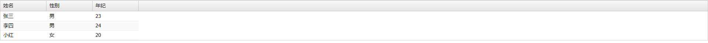
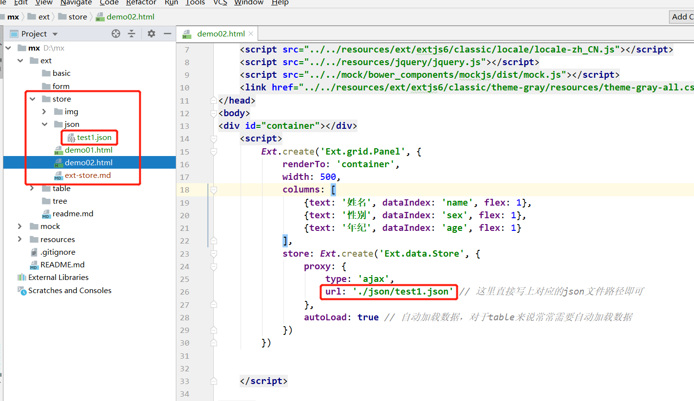
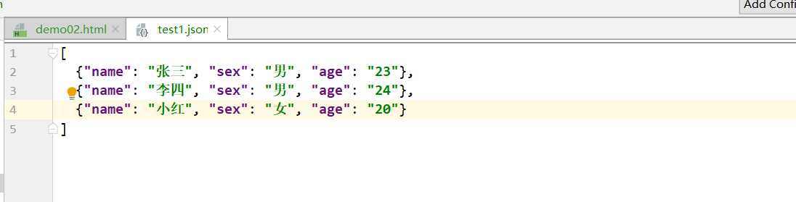
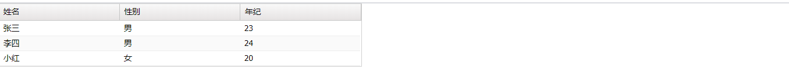
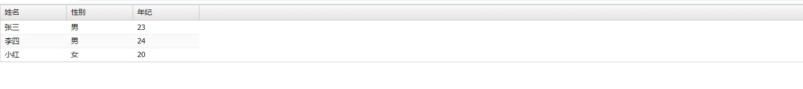

# ext store

​	1.Ext.data.Store是ext里的数据管理对象。该对象支持数据的排序与过滤，数据的加载是通过Ext.data.proxy.Proxy对象，数据加载后本地的增删改查是通过Ext.data.Model对象。

​	2.不同对象的store有不同之处，比如树与表格的store对象就有所差异。

​	3.store的api很多，用法也很复杂。此处指演示一些常用的api


## load

store常用的三种加载方式

### ajax

通过ajax调用后台接口获取数据

[案例代码]: ./demo01.html

```javascript
const baseUrl = 'http://mx' // 基础路径
        // 使用mock拦截ajax请求模拟后端接口
        // 由于ext调用接口时，url会带上?_dc，所以此处mock的url使用正则匹配
        Mock.mock(/http:\/\/mx\/test1/, function (option) {
            return [
                {name: '张三', sex: '男', age: '23'},
                {name: '李四', sex: '男', age: '24'},
                {name: '小红', sex: '女', age: '20'},
            ]
        })

        // 下面是先定义mode，再创建store，这里是为了演示store与model的关系，但在实际使用中，有时会在store中直接定义fields
        Ext.define('User', { // 定义数据模型
            extend: 'Ext.data.Model',
            fields: [
                {name: 'name'},
                {name: 'sex'},
                {name: 'age'}
            ]
        });

        var tableStore = Ext.create('Ext.data.Store', {
            storeId: 'tableStoreDemo01', // 给store一个storeId，那么当此store实例化后，可以通过Ext.data.StoreManager.lookup('tableStoreDemo01')获取此对象
            model: 'User', // 引用的model
            proxy: {
                type: 'ajax',
                url: baseUrl + '/test1'
            },
            autoLoad: true // 自动加载数据，对于table来说常常需要自动加载数据
        });

        Ext.create('Ext.grid.Panel', {
            renderTo: 'container',
            columns: [
                {text: '姓名', dataIndex: 'name'},
                {text: '性别', dataIndex: 'sex'},
                {text: '年纪', dataIndex: 'age'}
            ],
            store: Ext.data.StoreManager.lookup('tableStoreDemo01'), // 只要此store在本页面实例化，那么到处都可以使用此方法获取到该store
            // store: tableStore, // 虽然说也可以使用此方式，但是一旦store对象的实例化不在本js模块中，那么将无法引用到
        })
```



### json

直接读取本地的json数据

[案例代码]: ./demo02.html

```javascript
    renderTo: 'container',
            width: 500,
            columns: [
                {text: '姓名', dataIndex: 'name', flex: 1},
                {text: '性别', dataIndex: 'sex', flex: 1},
                {text: '年纪', dataIndex: 'age', flex: 1}
            ],
            store: Ext.create('Ext.data.Store', {
                proxy: {
                    type: 'ajax',
                    url: './json/test1.json' // 这里直接写上对应的json文件路径即可
                },
                autoLoad: true // 自动加载数据，对于table来说常常需要自动加载数据
            })
        })
```







### loadData

直接加载已经获取到的数据

[案例代码]: ./demo03.html

```javascript
const baseUrl = 'http://mx' // 基础路径
        // 使用mock拦截ajax请求模拟后端接口
        // 由于ext调用接口时，url会带上?_dc，所以此处mock的url使用正则匹配
        Mock.mock(/http:\/\/mx\/test1/, function (option) {
            return [
                {name: '张三', sex: '男', age: '23'},
                {name: '李四', sex: '男', age: '24'},
                {name: '小红', sex: '女', age: '20'},
            ]
        })

        // 构造一个空的store
        Ext.create('Ext.data.Store', {
            storeId: 'tableStoreDemo01', // 给store一个storeId，那么当此store实例化后，可以通过Ext.data.StoreManager.lookup('tableStoreDemo01')获取此对象
            autoLoad: true // 自动加载数据，对于table来说常常需要自动加载数据
        });
        var tableStore = Ext.data.StoreManager.lookup('tableStoreDemo01')
        Ext.create('Ext.grid.Panel', {
            renderTo: 'container',
            columns: [
                {text: '姓名', dataIndex: 'name'},
                {text: '性别', dataIndex: 'sex'},
                {text: '年纪', dataIndex: 'age'}
            ],
            store: tableStore
        })

        // 再通过ajax填充表格数据
        Ext.Ajax.request({
            url: baseUrl + '/test1',
            success: function (response) {
                var res = JSON.parse(response.responseText)
                tableStore.loadData(res) // 获取数据后加载到store中
            }
        })
```



## 增删改查

[案例代码]: ./demo04.html

```javascript
const baseUrl = 'http://mx' // 基础路径
    // 使用mock拦截ajax请求模拟后端接口
    // 由于ext调用接口时，url会带上?_dc，所以此处mock的url使用正则匹配
    Mock.mock(/http:\/\/mx\/test1/, function (option) {
        return [
            {name: '张三', sex: '男', age: '23', id: 1},
            {name: '李四', sex: '男', age: '24', id: 2},
            {name: '小红', sex: '女', age: '20', id: 99},
        ]
    })

    Ext.create('Ext.grid.Panel', {
        id: 'tableGridDemo04',
        renderTo: 'container',
        columns: [
            {text: '姓名', dataIndex: 'name'},
            {text: '性别', dataIndex: 'sex'},
            {text: '年纪', dataIndex: 'age'}
        ],
        store: Ext.create('Ext.data.Store', {
            storeId: 'tableStoreDemo04',
            proxy: {
                type: 'ajax',
                url: baseUrl + '/test1'
            },
            autoLoad: true // 自动加载数据，对于table来说常常需要自动加载数据
        }),
        tbar: [
            {text: 'add', handler: addTest},
            {text: 'delete', handler: deleteTest},
            {text: 'update', handler: updateTest},
            {text: 'query', handler: queryTest}
        ]
    })

    // 先获取table在获取store
    var myStore = Ext.getCmp('tableGridDemo04').getStore()
    // 也可以这样获取
    // var myStore = Ext.data.StoreManager.lookup('tableGridDemo04')

    // 增
    function addTest() {
        // add
        myStore.add({name: 'aaa', sex: '男', age: '18', id: 'aaa'})
        // loadData(data, [appended]) 参数1为添加的数据数组，参数2为是否追加添加，默认为false，当为true是追加添加，false会先清空store里的数据，再添加
        myStore.loadData([{name: 'bbb', sex: '女', age: '19', id: 'bbb'}], true) // 参数1必须为数组
    }
    
	// 删
    function deleteTest() {
        // myStore.removeAll() 清空store
        // remove(records) 参数为Ext.data.Model或Ext.data.Model数组
        // removeAt(index, [count]) 从当前索引（行）开始（包括当前索引）删除 count个数据   参数1为开始删除的索引，必须的     参数2为删除的数量，不是必须的，默认为1
        myStore.removeAt(0) // 删除第一条数据
    }
    
	// 改
    function updateTest() {
        // 先获取store里某条记录
        var record1 = myStore.getAt(0)
        record1.set('name', 'ccc') // 修改此记录里的某一个值
        var record2 = myStore.getAt(1)
        record2.set({ // 修改一组值
            'name': 'ddd',
            'age': '99'
        })
    }
    
	// 查
    function queryTest() {
        // 查询的方法有很多，此处介绍一些常用的

        // 1.getById(id) 通过id获取记录   我们在构建store时，常常会一个id值，可以通过id获取数据，注意id不可重复
        var record1 = myStore.getById('99')
        console.log('record1：')
        console.log(record1.getData()) // 从record里拿到原始数据使用getData()

        console.log('========================================================')

        // 2.getAt(index) 通过index索引获取记录，索引从0开始，第一条记录的索引为0
        var record2 = myStore.getAt(1)
        console.log('record2：')
        console.log('第二行记录的name值为' + record2.get('name')) // 从record对象里获取某个值使用get(fieldName)

        console.log('========================================================')

        // 3.findRecord(fieldName, value, [startIndex], [anyMatch], [caseSensitive], [exactMatch])
        // 根据一些列条件搜索记录
        // 这个方法参数很多，这里讲前两个参数的意义     第一个参数为fieldName，如我们这里的“name”，第二个参数为value，指的是name的值
        var record3 = myStore.findRecord('name', '小红') // 注意，若有两个name为小红的数据，那么这个方法会只返回第一条数据
        console.log('record3：')
        console.log(record3.getData())

        console.log('========================================================')

        // 4.first 返回第一条记录，last 返回最后一条记录，getCount() 获取记录条数
        console.log('第一条记录为：')
        console.log(myStore.first().getData())
        console.log('最后一条记录为：')
        console.log(myStore.last().getData())
        console.log('记录总数为：')
        console.log(myStore.getCount())

        console.log('========================================================')
        // 遍历store
        // 1.for循环遍历
        for (var i = 0; i < myStore.getCount(); i++) {
            console.log('name：' + myStore.getAt(i).get('name'))
        }
        // 2.each遍历
        myStore.each(function (item, index) { // item为当前记录，index为当前记录索引
            console.log('age：' + item.get('age'))
        })
    }
```

下面只截图查询部分，增删改请通过案例代码链接测试


## 添加额外参数与适配后台数据

在store自动加载数据时，有时我们常常需要添加额外参数，且后台数据有时会是一个对象里有个data属性，然后数据全部放在data里

[案例代码]: ./demo05.html

```javascript
const baseUrl = 'http://mx' // 基础路径
    // 使用mock拦截ajax请求模拟后端接口
    // 由于ext调用接口时，url会带上?_dc，所以此处mock的url使用正则匹配
    Mock.mock(/http:\/\/mx\/test1/, function (option) {
        // 常用的数据格式
        return {
            success: true,
            message: '',
            data: [
                {name: '张三', sex: '男', age: '23', id: 1},
                {name: '李四', sex: '男', age: '24', id: 2},
                {name: '小红', sex: '女', age: '20', id: 99},
            ]
        }
    })

    Ext.create('Ext.grid.Panel', {
        id: 'tableGridDemo04',
        renderTo: 'container',
        columns: [
            {text: '姓名', dataIndex: 'name'},
            {text: '性别', dataIndex: 'sex'},
            {text: '年纪', dataIndex: 'age'}
        ],
        store: Ext.create('Ext.data.Store', {
            storeId: 'tableStoreDemo04',
            proxy: {
                type: 'ajax',
                url: baseUrl + '/test1',
                // url: baseUrl + '/test1?' + 'xxx=yyy', 也可以这样传参
                extraParams: { // 添加额外参数
                    param1: 'aaa',
                    param2: 'bbb'
                },
                reader: {
                    // 解析我们需要的数据
                    // rootProperty: 'data', 写法1
                    rootProperty: function (data) { // 写法2
                        return data.data
                    }
                },
                getMethod: function(){ return 'POST' }, // 更改请求方式，默认为get
            },
            autoLoad: true // 自动加载数据，对于table来说常常需要自动加载数据
        })
    })
```