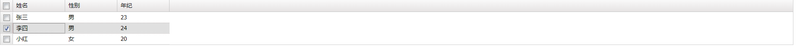

# ext表格

## 入门

[案例代码]: ./demo01.html

```html
<body>
<div id="container"></div> <!--准备渲染容器-->
<script>
    Ext.create('Ext.grid.Panel', { // 创建表格对象
        renderTo: 'container', // 指定渲染容器
        columns: [ // 指定列
            {text: '姓名', dataIndex: 'name'},
            {text: '性别', dataIndex: 'sex'},
            {text: '年纪', dataIndex: 'age'}
        ],
        store: Ext.create('Ext.data.Store', { // 指定渲染数据
            data: [
                {name: '张三', sex: '男', age: '23'},
                {name: '李四', sex: '男', age: '24'},
                {name: '小红', sex: '女', age: '20'},
            ]
        }),
    })
</script>
</body>
```


这就是一个最简单的ext表格，其中关键点：1.创建表格对象，2.指定列，3.指定渲染数据

## 常用属性

[案例代码]: ./demo02.html

```javascript
Ext.create('Ext.grid.Panel', {
        renderTo: 'container',
        title: '人员信息表', // 表格标题
        enableColumnHide: true, // 是否支持列可隐藏，默认为true
        sortableColumns: true, // 是否支持列可排序，默认为true
        tbar: [ // 表格上方按钮
            {
                text: '按钮1', handler: function () {
                    alert('按钮1被点击了')
                }
            },
            {
                text: '按钮2', handler: function () {
                    alert('按钮2被点击了')
                }
            }
        ],
        bbar: [ // 表格下方按钮
            {
                text: '按钮3', handler: function () {
                    alert('按钮3被点击了')
                }
            },
            {
                text: '按钮4', handler: function () {
                    alert('按钮4被点击了')
                }
            }
        ],
        buttons: [
            {
                text: '确定',
                handler: function () {
                    alert('确定')
                }
            },
            {
                text: '取消',
                handler: function () {
                    alert('取消')
                }
            }
        ],
        columns: [
            {text: '姓名', dataIndex: 'name', align: 'center'}, // align: 列数据的对齐方式
            {text: '性别', dataIndex: 'sex', sortable: false}, // sortable: false，此列不支持排序
            {text: '年纪', dataIndex: 'age',
                renderer: function (val) { // renderer函数支持将表格数据渲染成你想要的任何样式，如：
                    return '<input style="width: 50px" value="' + val +'"' + '/>'
                }
            },
            {
                text: '兴趣占比', columns: [ // 多级表头
                    {text: '篮球', dataIndex: 'hobby1'},
                    {text: '乒乓球', dataIndex: 'hobby2'}
                ]
            },
            {text: 'id', dataIndex: 'id', hidden: true} // hidden: true，此列默认被隐藏
        ],
        store: Ext.create('Ext.data.Store', {
            data: [
                {name: '张三', sex: '男', age: '23', hobby1: '30%', hobby2: '70%', id: 1},
                {name: '李四', sex: '男', age: '24', hobby1: '40%', hobby2: '60%',id: 2},
                {name: '小红', sex: '女', age: '20', hobby1: '45%', hobby2: '55%',id: 3},
                {name: '王五', sex: '男', age: '30', hobby1: '80%', hobby2: '20%',id: 4}
            ]
        }),
    })
```


### 1.表格本身属性

​	ext几乎所有对象的属性与方法都很多，这里只介绍简单的几种，具体用法参考上述代码和官网

​		title、enableColumnHide、sortableColumns

​	关于按钮：

​		1.tbar是top bar的简写，bbar（bottom bar），rbar（right bar），lbar（left bar）

​		2.bar与button

​			他们都是按钮，都可以设置点击事件完成相应的逻辑，不同的是他们是不同的对象，一个是Ext.tab.Bar，一个是Ext.button.Button，所以他们的属性和方法都有很多不一样的地方

​		3.tbar的完整写法如下：

```javascript
		dockedItems: [
            Ext.create('Ext.tab.Bar', {
                dock: 'top',
                items: [
                    Ext.create('Ext.button.Button', {
                        text: '按钮5',
                        handler: function () {
                            alert('按钮5被点击了')
                        }
                    })
                ]
            })
        ]
```

### 2.列的属性

​	在表格中，列属于一个单独的对象Ext.grid.column.Column

​		align、sortable、hidden、renderer、editor（这个下面再详细描述）

​		1.renderer

​			renderer可以将列渲染成你想要的任何的样子，但是不建议渲染成很复杂的dom，因为此函数返回的是字符串对象，复杂的dom使用字符串难以构建且难以维护

​		2.hidden

​			将hidden设置为true是将此列隐藏起来，但需要注意的是，一旦在定义或者创建一个table的时候，我们一开始就将此列隐藏起来，那么可能会影响其他的一些设置，如renderer、editor等等，猜测原因是因为列隐藏之后，那么renderer和editor不再加载，即使你之后使这列再显示。

## 可编辑表格

​	

[案例代码]: ./demo03.html

```javascript
Ext.create('Ext.grid.Panel', {
        renderTo: 'container',
        width: 400, // 设置整个表格的宽
        height: 500, // 设置整个表格的高
        border: true, // 表格是否有边框，默认为true
        plugins: [
            {
                ptype: 'cellediting', // 列可编辑
                clicksToEdit: 1 // 单击1一次进入编辑状态
            }
        ],
        columns: [
            {text: '姓名', dataIndex: 'name', flex: 1, editor: true}, // 此列可编辑
            {text: '性别', dataIndex: 'sex', flex: 1}, // flex设置此列的宽度占比为多少，此处写法代表三列等宽占满整个表格的宽
            {text: '年纪', dataIndex: 'age', flex: 1}
        ],
        store: Ext.create('Ext.data.Store', {
            data: [
                {name: '张三', sex: '男', age: '23'},
                {name: '李四', sex: '男', age: '24'},
                {name: '小红', sex: '女', age: '20'},
            ]
        }),
    })
```


### editor与renderer的区别

​	我们可以发现，使用editor可以编辑表格，但是使用renderer也可然表格变为input框，也可以进行编辑，但是不同的使，editor编辑之后，对应的store的数据改变了；但是使用renderer改变的只是显示数据，store里数据没有变化。如果把整个表格的store的数据作为表单提交的话，那么使用renderer编辑的数据还需要做额外的处理，保证store数据同步更新。

## 可勾选表格

[案例代码]: ./demo04.html

```

```

```javascript
Ext.create('Ext.grid.Panel', {
    renderTo: 'container',
    selModel: {
        selType: 'checkboxmodel',
        mode: 'simple' // SINGLE|SIMPLE|MULTI
    },
    columns: [
        {text: '姓名', dataIndex: 'name'},
        {text: '性别', dataIndex: 'sex'},
        {text: '年纪', dataIndex: 'age'}
    ],
    store: Ext.create('Ext.data.Store', {
        data: [
            {name: '张三', sex: '男', age: '23'},
            {name: '李四', sex: '男', age: '24'},
            {name: '小红', sex: '女', age: '20'},
        ]
    }),
})
```



## 表格事件	

​	我们可以看到，表格有很多的事件，此处只演示一些常用的事件

### itemclick与itemcontextmenu

​	表格行鼠标左键单击事件与右键单击事件

[案例代码]: ./demo05.html

```javascript
Ext.create('Ext.grid.Panel', {
            renderTo: 'container',
            columns: [
                {text: '姓名', dataIndex: 'name'},
                {text: '性别', dataIndex: 'sex'},
                {text: '年纪', dataIndex: 'age'}
            ],
            store: Ext.create('Ext.data.Store', {
                data: [
                    {name: '张三', sex: '男', age: '23'},
                    {name: '李四', sex: '男', age: '24'},
                    {name: '小红', sex: '女', age: '20'}
                ]
            }),
            listeners: {
                'itemclick': function (grid, record, itemElement, index, e, eOptions) {
                    /**
                     * grid：表格本身，this
                     * record：表格此行的record对象，数据集合
                     * itemElement: 此行的element对象，html元素
                     * index：此行在表格中的索引，从0开始
                     * e：事件本身，此处指的是ext里的事件对象
                     * eOption：选项对象，一般不用
                     */

                    alert('姓名:' + record.get('name')) // 关于record对象的使用，请详见Ext.data.Model
                },
                'itemcontextmenu': function (grid, record, itemElement, index, e, eOptions) {
                    // 参数意义与itemclick相同
                    e.preventDefault() // 经用浏览器本身的右键事件
                    alert('行数:' + index)
                }
            }
    })
```


## 特殊表格列

### 跳转链接

[案例代码]: ./demo06.html

​	

```html
<!DOCTYPE html>
<html lang="en">
<head>
    <meta charset="UTF-8">
    <title>demo06</title>
    <script src="../../resources/ext/extjs6/ext-all.js"></script>
    <script src="../../resources/ext/extjs6/classic/locale/locale-zh_CN.js"></script>
    <link href="../../resources/ext/extjs6/classic/theme-gray/resources/theme-gray-all.css" rel="stylesheet" />
    <style>
        .sex {
            background: blue;
        }
    </style>
</head>
<body>
<div id="container"></div>
<script>
    Ext.create('Ext.grid.Panel', {
        renderTo: 'container',
        columns: [
            {
                text: '姓名', dataIndex: 'name', renderer: function (val) {
                    return '<div style="text-decoration:underline; color: #0000EE" onclick="toNameDetail(\'' + val + '\')">' + val + '</div>'
                    // 不仅设置样式，还设置点击事件
                }
            },
            {
                text: '性别', dataIndex: 'sex', renderer: function (val) {
                    return '<div style="text-decoration:underline; color: #0000EE">' + val + '</div>' // 只设置类似于a标签的样式，但具体的点击事件在listeners里设置
                }

            },
            {
                text: '年纪', dataIndex: 'age', renderer: function (val, metaData, record) {
                    if (record.get('sex') === '男' && record.get('age') > 23) { // 男性且年纪大于23则背景标红
                        metaData.tdStyle = 'background: blue' // 简单样式写法
                        // metaData.css = 'sex' // 直接设置css的class
                    }
                    return val
                }
            }
        ],
        store: Ext.create('Ext.data.Store', {
            data: [
                {name: '张三', sex: '男', age: '23'},
                {name: '李四', sex: '男', age: '24'},
                {name: '小英', sex: '女', age: '25'},
                {name: '小红', sex: '女', age: '20'},
            ]
        }),
        listeners: {
            'cellclick': function (grid, td, cellIndex, record, tr, rowIndex, e, eOpts) { // 列的点击事件
                if (cellIndex === 1) { // 第二列
                    toSexDetail(record.get('sex'))
                }
            }
        }
    })

    function toNameDetail(val) {
        Ext.create('Ext.window.Window', {
            width: 500,
            height: 500,
            modal: true, // 当前window弹出来后，其他区域有幕布遮挡
            title: '详情面板',
            html: '姓名: ' + val
        }).show()
    }

    function toSexDetail(val) {
        Ext.create('Ext.window.Window', {
            width: 500,
            height: 500,
            modal: true, // 当前window弹出来后，其他区域有幕布遮挡
            title: '详情面板',
            html: '性别: ' + val
        }).show()
    }
</script>
</body>
</html>
```


#### 注意事项

​	做列的跳转链接时，需要注意的是，使用renderer虽然是可以构建各种html元素，但是在给事件的方法添加参数时，非常不方便，很多时候还需要转义字符，所以不推荐使用renderer写超链接。

### 可操作列

[案例代码]: ./demo07.html

```javascript
    Ext.create('Ext.grid.Panel', {
        width: 500,
        renderTo: 'container',
        columns: [
            {text: '姓名', dataIndex: 'name', flex: 1},
            {text: '性别', dataIndex: 'sex', flex: 1},
            {text: '年纪', dataIndex: 'age', flex: 1},
            {
                xtype: 'actioncolumn', // action列
                align: 'center',
                width: 30,
                items: [
                    {
                        icon: './icons/delete.png',
                        tooltip: '删除',
                        handler: function(grid, rowIndex, colIndex, action, e, record) {
                            Ext.MessageBox.confirm('提示', '你确定删除此行记录吗？', function (val) {
                                if (val === 'yes') {
                                    grid.getStore().remove(record)
                                }
                            })
                        }
                    }
                ]
            }
        ],
        store: Ext.create('Ext.data.Store', {
            data: [
                {name: '张三', sex: '男', age: '23'},
                {name: '李四', sex: '男', age: '24'},
                {name: '小红', sex: '女', age: '20'},
            ]
        }),
    })

```


## 案例

### 根据后台数据动态生成table列

[案例代码]: ./demo08.html

```html
<!DOCTYPE html>
<html lang="en">
<head>
    <meta charset="UTF-8">
    <title>demo08</title>
    <script src="../../resources/ext/extjs6/ext-all.js"></script>
    <script src="../../resources/ext/extjs6/classic/locale/locale-zh_CN.js"></script>
    <script src="../../resources/mock/bower_components/mockjs/dist/mock.js"></script>
    <link href="../../resources/ext/extjs6/classic/theme-gray/resources/theme-gray-all.css" rel="stylesheet" />
</head>
<body>
<div id="container1"></div>
<div id="container2"></div>
<script>
    const baseUrl = 'http://mx' // 基础路径
    // 使用mock拦截ajax请求模拟后端接口
    // 由于ext调用接口时，url会带上?_dc，所以此处mock的url使用正则匹配
    Mock.mock(/http:\/\/mx\/test1/, function (option) {
        // 常用的数据格式
        return {
            success: true,
            message: '',
            data: {
                data: [
                    {name: '张三', sex: '男', age: '23'},
                    {name: '李四', sex: '男', age: '24'},
                    {name: '小红', sex: '女', age: '20'}
                ],
                columns: [
                    {text: '姓名', dataIndex: 'name'},
                    {text: '性别', dataIndex: 'sex'},
                    {text: '年纪', dataIndex: 'age'}
                ]
            }
        }
    })

    Mock.mock(/http:\/\/mx\/test2/, function (option) {
        // 常用的数据格式
        return {
            success: true,
            message: '',
            data: {
                data: [
                    {name: '张三', age: '23', id: 1},
                    {name: '李四', age: '24', id: 2},
                    {name: '小红', age: '20', id: 99}
                ],
                columns: [
                    {text: '姓名', dataIndex: 'name'},
                    {text: '年纪', dataIndex: 'age'},
                    {text: 'id', dataIndex: 'id'}
                ]
            }
        }
    })

    // 第一种方法
    var containerPanel1 = Ext.create('Ext.panel.Panel', {
        renderTo: 'container1',
        items: [],
        tbar: [
            {text: '入口1', handler: test1},
            {text: '入口2', handler: test2}
        ]
    })

    function test1() {
        Ext.Ajax.request({
            url: baseUrl + '/test1',
            success: function (res) {
                updateTable1(res)
            }
        })
    }
    function test2() {
        Ext.Ajax.request({
            url: baseUrl + '/test2',
            success: function (res) {
                updateTable1(res)
            }
        })
    }

    function updateTable1(res) {
        res = JSON.parse(res.responseText)
        if (res.success) {
            var table = Ext.create('Ext.grid.Panel', {
                columns: res.data.columns,
                store: Ext.create('Ext.data.Store', {
                    data: res.data.data
                })
            })
            containerPanel1.removeAll() // 先移除
            containerPanel1.add(table) // 再添加
        }
    }

    // 第二种方法
    var containerPanel2 = Ext.create('Ext.panel.Panel', {
        renderTo: 'container2',
        items: [
            Ext.create('Ext.grid.Panel', {
                id: 'grid2'
            })
        ],
        tbar: [
            {text: '入口3', handler: test3},
            {text: '入口4', handler: test4}
        ]
    })
    
    function test3() {
        Ext.Ajax.request({
            url: baseUrl + '/test1',
            success: function (res) {
                updateTable2(res)
            }
        })
    }
    
    function test4() {
        Ext.Ajax.request({
            url: baseUrl + '/test2',
            success: function (res) {
                updateTable2(res)
            }
        })
    }

    function updateTable2(res) {
        res = JSON.parse(res.responseText)
        if (res.success) {
            // reconfigure([store], [columns]) 重置table的store与columns
            var store = Ext.create('Ext.data.Store', {
                data: res.data.data
            })
            Ext.getCmp('grid2').reconfigure(store, res.data.columns)
        }
    }
</script>

</body>
</html>
```


### 列的点击事件应用

[案例代码]: ./demo09.html

```javascript
const baseUrl = 'http://mx' // 基础路径
    // 使用mock拦截ajax请求模拟后端接口
    // 由于ext调用接口时，url会带上?_dc，所以此处mock的url使用正则匹配
    Mock.mock(/http:\/\/mx\/getEx/, function (option) {
        var id = option.body.split('=')[1]
        if (id === '1') {
            return [
                {item: '篮球', grade: '70'},
                {item: '足球', grade: '60'},
                {item: '吉他', grade: '40'}
            ]
        } else if (id === '2') {
            return [
                {item: '篮球', grade: '80'},
            ]
        } else if (id === '3') {
            return [
                {item: '游戏', grade: '90'},
                {item: '跑步', grade: '50'}
            ]
        }
    })

    Ext.create('Ext.grid.Panel', {
        width: 500,
        height: 500,
        renderTo: 'container',
        columns: [
            {text: '姓名', dataIndex: 'name', flex: 1, align: 'center', renderer: function (val, meta, record) {
                    meta.tdStyle = 'text-decoration:underline; color: #0000EE' // 给此单元格一个a标签的样式
                    return val
                }
            },
            {text: '性别', dataIndex: 'sex', flex: 1, align: 'center'},
            {text: '年纪', dataIndex: 'age', flex: 1, align: 'center'}
        ],
        store: Ext.create('Ext.data.Store', {
            data: [
                {name: '张三', sex: '男', age: '23', id: '1'},
                {name: '李四', sex: '男', age: '24', id: '2'},
                {name: '王五', sex: '女', age: '20', id: '3'}
            ],
        }),
        listeners: {
            'cellclick': function (grid, td, cellIndex, record, tr, rowIndex, e, eOpts) { // 列的点击事件
                if (cellIndex === 0) { // 第一列
                    Ext.Ajax.request({
                        url: baseUrl + '/getEx',
                        params: {
                            id: record.get('id')
                        },
                        success: function (res) {
                            showEx() // 弹出面板
                            res = JSON.parse(res.responseText)
                            var exStore = Ext.data.StoreManager.lookup('exStore')
                            exStore.loadData(res, false) // 清空并添加数据

                        }
                    })
                }
            }
        }
    })

    function showEx() {
        Ext.create('Ext.window.Window', {
            width: 500,
            height: 500,
            modal: true, // 当前window弹出来后，其他区域有幕布遮挡
            items: [
                Ext.create('Ext.grid.Panel', {
                    title: '个人兴趣列表',
                    columns: [
                        {text: '兴趣项', dataIndex: 'item', flex: 1, align: 'center'},
                        {text: '兴趣值', dataIndex: 'grade', flex: 1, align: 'center'},
                    ],
                    store: Ext.create('Ext.data.Store', {
                        storeId: 'exStore',
                    })
                })
            ]
        }).show()
    }
```

